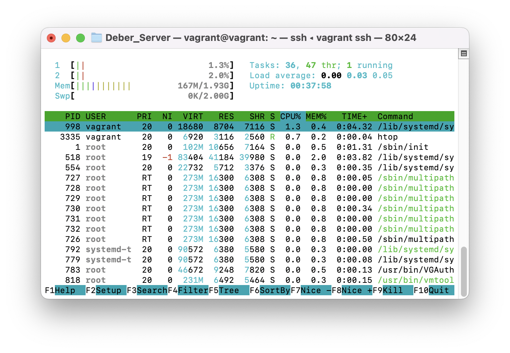
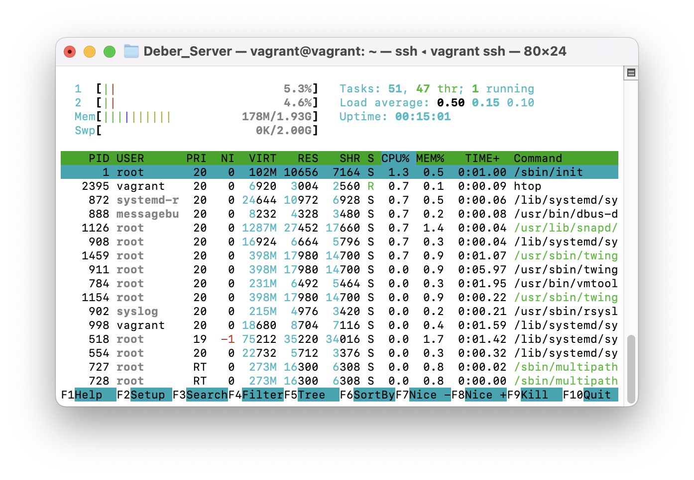
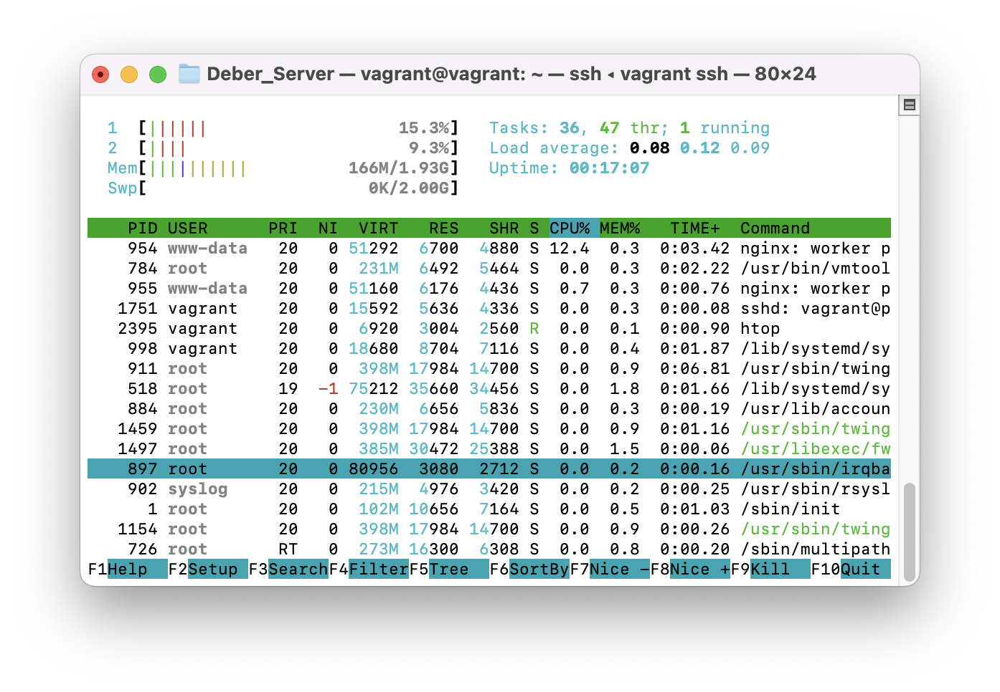
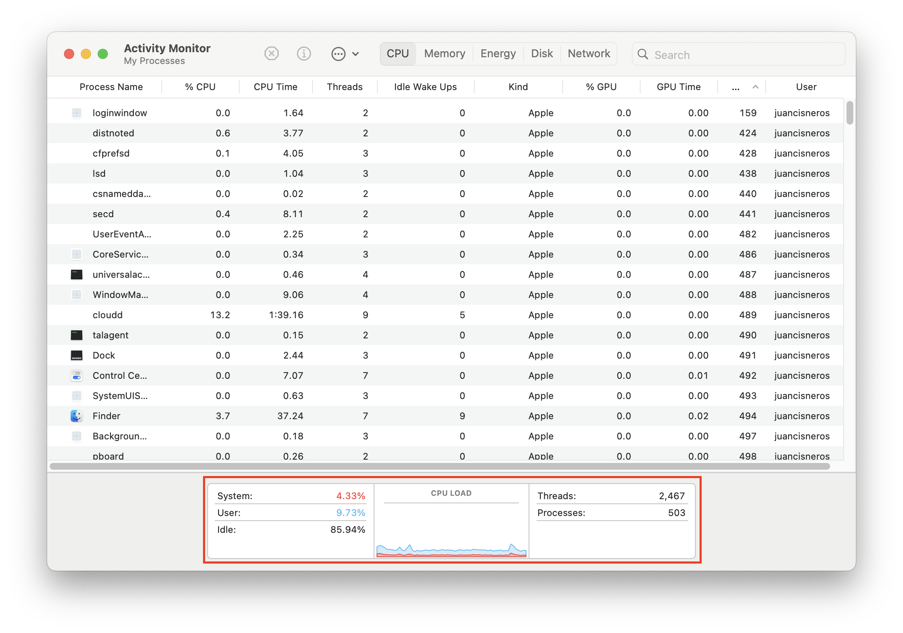
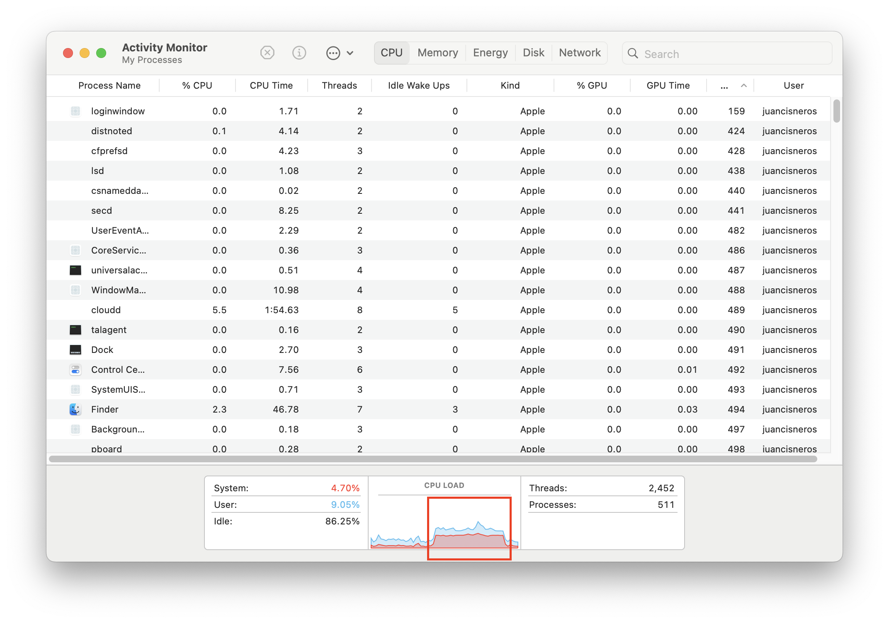
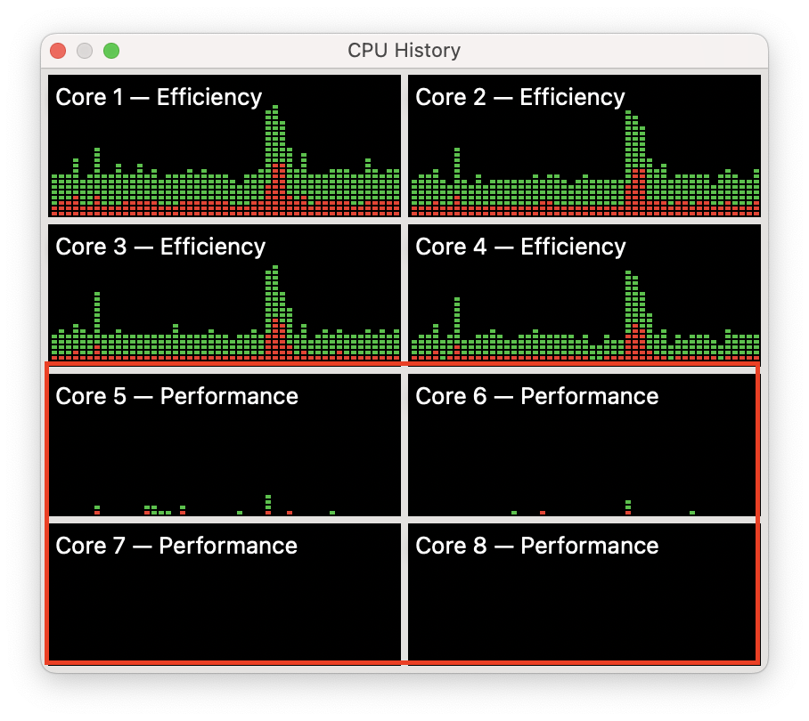
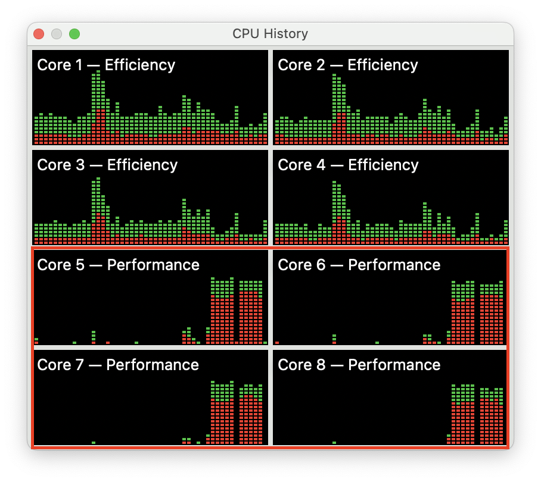

# Cloud Computing

# Homework 1 - Containers and Virtual Machines

In this assignment we will be comparing the usage and performance of both virtual machines and containers. For this activity, you’ll be working on groups of 2 people (max 3).

# Requirements:

The server: 1 computer running Vagrant and Docker

The client: 1 computer with at least Vagrant

# Experiment 1:

For the server, write a Vagrant file that starts a Ubuntu VM, installs and configures a web server such as NGINX, and starts up the web server. The web server should host a very simple web page.

In the client, you’ll write a Vagrant file that starts Ubuntu and installs wrk. Then you’ll login into the VM, and use wrk to run a load test against the web server running in the server machine.

You can find wrk at: https://github.com/wg/wrk

Note that for this experiment to work, you will need to make sure that you configure the network of the VM in the right way. You can find tutorials online on how to do this.

Make sure that your load test runs for at least 3 minutes. Your load test should generate at least 100 requests per second. When your load test is running, you should take screenshots that show the CPU and memory utilization of the server machine.

# Report experiment 1:

### 1.1. Vagrant file for the server

Para está primera sección se utilizó el siguiente Vagrantfile para la creación de la máquina virtual en la que se instalará el servidor web.

En este caso hemos decidido utilizar la documentación oficial de Vagrant para la creación de la máquina virtual.

```
Vagrant.configure("2") do |config|
   # Se configura el box a utilizar, en este caso es una máquina virtual 
   # con Ubuntu 20.04 para arquitectura ARM64 debido a que se 
   #utilizará una máquina con procesador M2 de Apple.
  config.vm.box = "bento/ubuntu-20.04-arm64"
  
   # Se configura un puerto para la máquina virtual, en este caso se
   # realizó esto ya que debiamos exponer el puerto para que el cliente
   # pudiera realizar las pruebas de carga.
   config.vm.network "private_network", ip: "192.168.33.10"

   # Se configura el port forwarding para que el puerto 80 de la máquina
   # virtual sea accesible desde el puerto 8080 del host.
   # Esto es debido a que el puerto 80 de la máquina virtual será el puerto
   # en el que se expondrá el servidor web, en este caso la página de NGINX.
  config.vm.network "forwarded_port", guest: 80, host: 8080

   # Se configura la máquina para que una vez inicie se ejecute un script
   # que instalará el servidor web NGINX. Además de iniciar el servicio.
    config.vm.provision "shell", inline: <<-SHELL
      apt-get update
      sudo apt-get -y install nginx
      sudo service nginx start
      # Utilidad para monitorear el uso de CPU y memoria
      sudo apt-get install htop
    SHELL
end
```
Inicializamos la máquina virtual con el siguiente comando.

```
vagrant up
```


Una vez inicializada la máquina virtual, nos conectamos a la misma usando

```
vagrant ssh
```

Dentro de la misma hemos realizado la siguiente configuración para el servidor web.

1. Hemos habilitado los puertos del firewall para el servidor web.

```
sudo ufw enable
```
```
sudo ufw app list
# Este comando nos regresó la siguiente lista de aplicaciones
Output
Available applications:
  Nginx Full
  Nginx HTTP
  Nginx HTTPS
  OpenSSH
```
2. Hemos habilitado el puerto 80 en el firewall de la máquina virtual.

```
sudo ufw allow 'Nginx HTTP'
```

```
sudo ufw status

# Este comando nos regresó la siguiente lista de aplicaciones
Output
Status: active
To                         Action      From
--                         ------      ----
Nginx HTTP                 ALLOW       Anywhere                  
Nginx HTTP (v6)            ALLOW       Anywhere (v6)
```
3. Verificamos el estado del servidor web.

```
sudo systemctl status nginx
```

```
Output
● nginx.service - A high performance web server and a reverse proxy server
     Loaded: loaded (/lib/systemd/system/nginx.service; enabled; vendor preset:>
     Active: active (running) since Fri 2024-02-23 16:33:35 UTC; 21s ago
       Docs: man:nginx(8)
   Main PID: 951 (nginx)
      Tasks: 3 (limit: 2225)
     Memory: 8.3M
     CGroup: /system.slice/nginx.service
             ├─951 nginx: master process /usr/sbin/nginx -g daemon on; master_p>
             ├─954 nginx: worker process
             └─955 nginx: worker process

Feb 23 16:33:35 vagrant systemd[1]: Starting A high performance web server and >
Feb 23 16:33:35 vagrant systemd[1]: Started A high performance web server and a>
```

4. Verificamos el acceso al servidor web desde el terminal y navegador local.

```
ping 192.168.33.10
```

```
curl 192.168.33.10

# Este comando nos regresó el siguiente resultado
Output
<!DOCTYPE html>
<html>
<head>
<title>Welcome to nginx!</title>
<style>
    body {
        width: 35em;
        margin: 0 auto;
        font-family: Tahoma, Verdana, Arial, sans-serif;
    }
</style>
</head>
<body>
<h1>Welcome to nginx!</h1>
<p>If you see this page, the nginx web server is successfully installed and
working. Further configuration is required.</p>

<p>For online documentation and support please refer to
<a href="http://nginx.org/">nginx.org</a>.<br/>
Commercial support is available at
<a href="http://nginx.com/">nginx.com</a>.</p>

<p><em>Thank you for using nginx.</em></p>
</body>
</html>
```

Como podemos observar, el servidor web ha sido instalado y configurado correctamente.

5. Corremos el comando htop para monitorear el uso de CPU y memoria. Este comando fue instalado en el script de vagrant.

```
htop
```



### 1.2. Vagrant file for the client
Para está primera sección se utilizó el siguiente Vagrantfile para la creación de la máquina virtual en la que se instalará el servidor web.

En este caso hemos decidido utilizar la documentación oficial de Vagrant para la creación de la máquina virtual.

```
   # Se configura el box a utilizar, en este caso es una máquina virtual 
   # con Ubuntu 20.04 para arquitectura ARM64 debido a que se 
   #utilizará una máquina con procesador M2 de Apple.
   config.vm.box = "bento/ubuntu-20.04-arm64"
  
   # Se configura la máquina para que una vez inicie se ejecute un script
   # que instalará la herramienta wrk.
   config.vm.provision "shell", inline: <<-SHELL
       apt-get update
       
       sudo apt-get install build-essential libssl-dev git -y 
       git clone https://github.com/wg/wrk.git wrk 
       cd wrk 
       sudo make 
       # movemos el ejecutable a la carpeta bin para que sea accesible 
       # desde cualquier lugar
       sudo cp wrk /usr/local/bin 
     SHELL
end
```


Inicializamos la máquina virtual con el siguiente comando.

```
vagrant up
```


Una vez inicializada la máquina virtual, nos conectamos a la misma usando
```
vagrant ssh
```
### 1.3. Load test

Para realizar la prueba de carga, hemos utilizado la herramienta wrk que hemos instalado en la máquina cliente.

Verificamos que tenemos acceso al servidor web desde la máquina cliente.

```
curl 192.168.33.10
```

```
Output
<!DOCTYPE html>
<html>
<head>
<title>Welcome to nginx!</title>
<style>
    body {
        width: 35em;
        margin: 0 auto;
        font-family: Tahoma, Verdana, Arial, sans-serif;
    }
</style>
</head>
<body>
<h1>Welcome to nginx!</h1>
<p>If you see this page, the nginx web server is successfully installed and
working. Further configuration is required.</p>

<p>For online documentation and support please refer to
<a href="http://nginx.org/">nginx.org</a>.<br/>
Commercial support is available at
<a href="http://nginx.com/">nginx.com</a>.</p>

<p><em>Thank you for using nginx.</em></p>
</body>
</html>
```


Para realizar la prueba de carga, hemos utilizado el siguiente comando.

```
wrk -t12 -c400 -d30s http://192.168.33.10

# Este comando nos regresó el siguiente resultado
Output
Running 30s test @ http://192.168.33.10
  12 threads and 400 connections
    Thread Stats   Avg      Stdev     Max   +/- Stdev
    Latency   106.37ms   35.25ms 213.97ms   60.44%
    Req/Sec   313.09    148.50   727.00     71.13%
  110761 requests in 30.05s, 90.73MB read
Requests/sec:   3685.71
Transfer/sec:      3.02MB

```

### 1.4. Resultados de la prueba de carga

Una vez realizada la prueba de carga, hemos tomado capturas de pantalla del uso de CPU y memoria de la máquina virtual que se encuentra corriendo el servidor web.

Imagen 1. Uso de CPU y memoria de la máquina virtual que se encuentra corriendo el servidor web. Sin carga.


Imagen 2. Uso de CPU y memoria de la máquina virtual que se encuentra corriendo el servidor web. Con carga.

```agsl
Como podemos ver la carga no es muy alta, pero si se observa un incremento en el uso de CPU y memoria.
Hemos decidido verificar el uso de CPU y memoria en la máquina local.
```

Imagen 3. Uso de CPU y memoria de la máquina local. Sin carga.


Imagen 4. Uso de CPU y memoria de la máquina local. Con carga.

```agsl
En este caso vemos que el uso de CPU y memoria en la máquina local hace un spike
durante la ejecución de la prueba de carga.

De igual forma la utilizacion de CPU subió a un 50% lo que no se ve en la imagen debido 
a que la captura de pantalla fue realizada después de la ejecución de la prueba de carga.
```

Imagen 5. Uso de CPU y memoria de la máquina local. Sin carga. Grafica.


Imagen 6. Uso de CPU y memoria de la máquina local. Con carga. Grafica.


```agsl
Como podemos observa los performance cores de la máquina local se encuentran en un 90% de uso
durante la ejecución de la prueba de carga. A comparación de la gráfica sin carga, donde el uso
de los performance cores se encuentra en descanso.
```

# Report Experiment 2:


